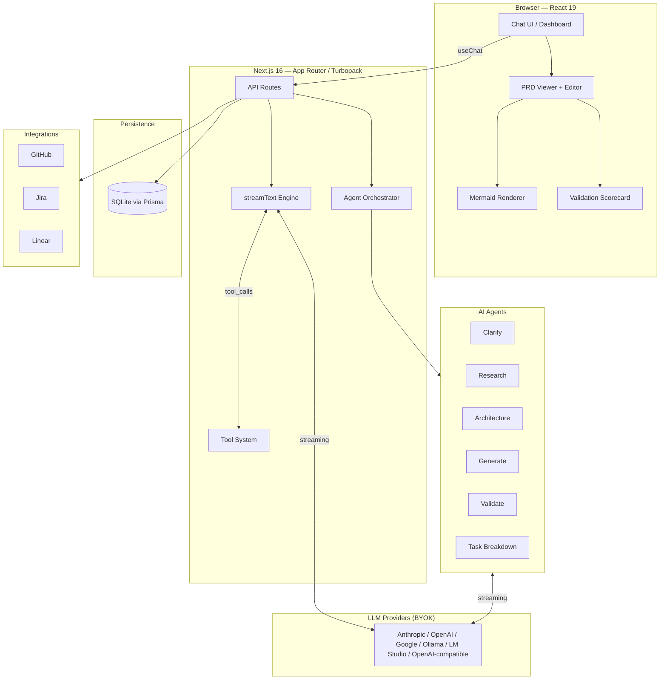
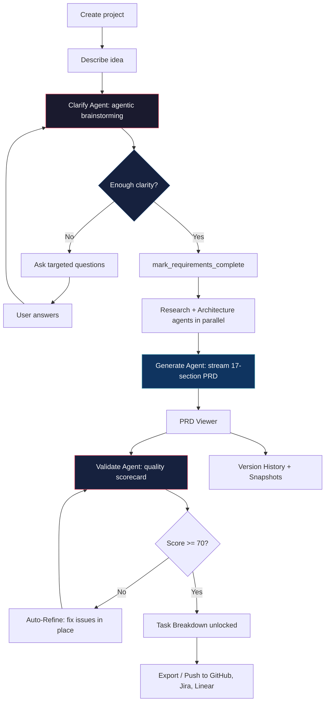
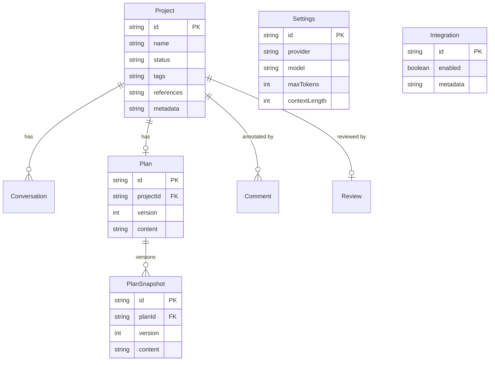

# ai-prd

**ai-prd** is a self-hosted, bring-your-own-key (BYOK) web app that acts as a senior product strategist. It interviews you about your idea, challenges assumptions, optionally researches the market and proposes an architecture, then streams a complete 17-section PRD — with live Mermaid diagrams, quality validation, version history, task breakdown, and one-click push to GitHub / Jira / Linear.

---

## Table of Contents

- [Highlights](#highlights)
- [Architecture](#architecture)
- [Agentic Pipeline](#agentic-pipeline)
- [Request Lifecycle](#request-lifecycle)
- [Tech Stack](#tech-stack)
- [Quick Start](#quick-start)
- [Docker](#docker)
- [How It Works](#how-it-works)
- [PRD Output Structure](#prd-output-structure)
- [Data Model](#data-model)
- [Project Structure](#project-structure)
- [Configuration](#configuration)
- [Environment Variables](#environment-variables)
- [Scripts](#scripts)
- [CI/CD](#cicd)
- [License](#license)

---

## Highlights

- **Agentic Brainstorming** — the AI adaptively decides how many questions to ask (simple ideas: ~2 rounds, complex: up to a 7-round safety cap) instead of following a rigid script.
- **Multi-Agent Pipeline** — dedicated agents for clarification, research, architecture, generation, validation, and task breakdown, coordinated by an orchestrator.
- **Streaming Everything** — chat, PRD generation, and refinement stream token-by-token via AI SDK v6.
- **17-Section PRD** — a structure-locked document covering everything from executive summary to sequence diagrams. The structure is enforced end-to-end so the document never drifts or bloats.
- **Quality Gate** — an automated validator scores the PRD across 5 dimensions and gates the Task Breakdown step until quality passes.
- **Auto-Refine** — one click feeds validation issues back to the model to improve the document in place (without adding redundant sections).
- **Live Mermaid Diagrams** — flowcharts, ERDs, and sequence diagrams render to SVG client-side.
- **Version History** — every revision is snapshotted; restore any prior version.
- **Integrations** — push the PRD or generated tasks to GitHub Issues, Jira, or Linear.
- **BYOK Multi-Provider** — Anthropic, OpenAI, Google, Ollama, LM Studio, AgentRouter, or any OpenAI-compatible endpoint.
- **Docker-Ready** — single-command deployment with a persistent SQLite volume.

---

## Architecture



---

## Agentic Pipeline



The Clarify Agent behaves like a critical brainstorming partner, not an interviewer — it challenges assumptions and suggests alternatives. Before generation, the Research and Architecture agents run in parallel to enrich the PRD (gracefully degrading if they fail). After generation, the Validate Agent gates the workflow: Task Breakdown stays locked until the PRD scores at least 70/100.

---

## Request Lifecycle

How a single PRD generation request flows through the system:

```
 Browser                Next.js API            Agents / LLM           SQLite
    |                        |                       |                   |
    |  POST /generate        |                       |                   |
    |----------------------->|                       |                   |
    |                        | snapshot current plan |                   |
    |                        |---------------------------------------->  |
    |                        | research + architecture (parallel)        |
    |                        |---------------------->|                   |
    |                        |<----------------------| enriched context  |
    |                        | streamText(generate)  |                   |
    |                        |---------------------->|                   |
    |   SSE: text-delta ...  |<======================| token stream      |
    |<=======================|                       |                   |
    |   (live PRD render)    |                       |                   |
    |                        | onFinish: strip extra |                   |
    |                        | sections + save plan  |                   |
    |                        |---------------------------------------->  |
    |   SSE: finish          |                       |                   |
    |<-----------------------|                       |                   |
```

The client consumes the stream to completion so the server's `onFinish` callback always fires — persisting the final document and incrementing the plan version.

---

## Tech Stack

| Layer | Technology |
|-------|-----------|
| Framework | Next.js 16.2 (App Router, Turbopack, React 19) |
| AI | AI SDK v6 (`streamText`, `useChat`, tool calls, `maxSteps`) |
| UI | Tailwind CSS 4, shadcn/ui, Lucide icons, `next-themes` |
| Database | SQLite via Prisma 6.19 (generated client) |
| Diagrams | Mermaid.js (client-side SVG) + `react-markdown` / `remark-gfm` |
| Export | `marked`, `jspdf`, `html2canvas` |
| Diffing | `diff`, `react-diff-view`, `unidiff` (version comparison) |
| Validation | `zod` schemas for structured agent output |
| Language | TypeScript 5 (strict) |
| Container | Docker multi-stage build (Node 20 Alpine) |
| Testing | Vitest, Playwright |

---

## Quick Start

### Prerequisites

- Node.js 20+
- npm 10+
- An API key for at least one LLM provider (or a local Ollama / LM Studio endpoint)

### Local Development

```bash
git clone https://github.com/mrizkihidayat66/ai-prd.git
cd ai-prd
npm install
npm run setup            # creates .env, runs the doctor, generates the Prisma client
npm run db:push          # creates the SQLite database from the schema
# add a provider key:
npm run setup:api-key -- ANTHROPIC_API_KEY sk-ant-xxxx
npm run dev
```

Open <http://localhost:3000>. You can also configure the provider and key in-app via the Settings dialog (sidebar gear icon).

---

## Docker

```bash
docker compose up -d --build
```

The app is served on **port 3333** (mapped to 3000 in the container). Data persists in the `app-data` Docker volume at `/app/data/prod.db`. The container migrates the database idempotently on every boot via `scripts/start.sh`.

Provider keys are read from your shell environment (or a local `.env`) and passed through by `docker-compose.yml`:

```bash
ANTHROPIC_API_KEY=sk-ant-xxxx docker compose up -d --build
```

Supported passthrough vars: `ANTHROPIC_API_KEY`, `OPENAI_API_KEY`, `GOOGLE_API_KEY`, `AGENTROUTER_API_KEY`, `OPENAI_COMPATIBLE_API_KEY`, `OPENAI_COMPATIBLE_BASE_URL`.

### Docker Commands

```bash
docker compose up -d --build     # build and start
docker compose logs -f app       # follow logs (service name: app)
docker compose down              # stop
docker compose down -v           # stop and DELETE the data volume (destructive)
```

---

## How It Works

1. **Create a project** — from the dashboard, optionally starting from a template.
2. **Describe your idea** — the Clarify Agent engages as a brainstorming partner.
3. **Adaptive clarification** — it asks targeted questions only when needed (max 7 rounds), with clickable option cards and AI recommendations.
4. **Generate** — Research + Architecture agents enrich the context, then the Generate Agent streams a 17-section PRD in real time.
5. **Validate** — the quality scorecard scores 5 dimensions; Auto-Refine fixes flagged issues without bloating the document.
6. **Iterate** — edit inline, refine via instructions, compare versions, restore snapshots.
7. **Deliver** — break the PRD into tasks, export as Markdown/PDF, or push to GitHub / Jira / Linear.

---

## PRD Output Structure

The generated PRD contains **exactly 17 top-level sections**, enforced across generation, refinement, and validation so the document never drifts or accumulates redundant sections:

| # | Section | # | Section |
|---|---------|---|---------|
| 1 | Executive Summary | 10 | UI/UX Flow (+ Mermaid) |
| 2 | Problem Statement & Goals | 11 | Implementation Roadmap |
| 3 | Target Users & Personas | 12 | Effort Estimate |
| 4 | User Stories & Acceptance Criteria | 13 | Non-Functional Requirements |
| 5 | Feature Specification (MVP vs Future) | 14 | Success Metrics & KPIs |
| 6 | System Architecture (+ Mermaid) | 15 | Risks & Mitigations |
| 7 | Technology Stack | 16 | Appendix: Sequence Diagrams |
| 8 | API Design (+ endpoint tables) | 17 | References & Resources |
| 9 | Data Model (+ Mermaid ERD) | | |

A completed document ends with a `<!-- PRD_COMPLETE -->` marker, which the app uses to reliably detect completion.

---

## Data Model



`metadata` on `Project` stores JSON for validation results, task breakdowns, and other agent output. Templates, Integrations, Comments, and Reviews round out the schema (see `prisma/schema.prisma`).

---

## Project Structure

```
src/
├── app/                          # Next.js pages and API routes
│   ├── api/
│   │   ├── analytics/            # Aggregate dashboard stats
│   │   ├── chat/                 # Streaming chat with tool calls
│   │   ├── integrations/         # GitHub / Jira / Linear config + push
│   │   ├── models/               # Available model list per provider
│   │   ├── projects/
│   │   │   └── [id]/
│   │   │       ├── generate/     # PRD generation (streaming)
│   │   │       ├── refine/       # PRD refinement (streaming)
│   │   │       ├── validate/     # Quality scorecard
│   │   │       ├── tasks/        # Task breakdown
│   │   │       ├── export/       # Download PRD
│   │   │       ├── plan/         # Plan CRUD + snapshots
│   │   │       ├── snapshots/    # Version history
│   │   │       ├── comments/     # Collaboration comments
│   │   │       ├── review/       # Review status
│   │   │       ├── duplicate/    # Clone a project
│   │   │       └── edit, tags    # Inline edits + tagging
│   │   ├── search/               # Cross-project search
│   │   ├── settings/             # BYOK configuration + connection test
│   │   └── templates/            # Template CRUD + import/export
│   ├── new/                      # Chat page (new project)
│   ├── project/[id]/             # Project detail + PRD viewer
│   └── page.tsx                  # Dashboard
├── components/
│   ├── common/                   # Mermaid renderer, shared widgets
│   ├── layout/                   # App shell with collapsible sidebar
│   └── ui/                       # shadcn/ui primitives
├── features/
│   ├── chat/                     # Chat UI + tool renderers
│   ├── collaboration/            # Comments + review status
│   ├── dashboard/                # Project grid, cards, filters, stats
│   ├── plan/                     # PRD viewer, editor, version selector, refine
│   ├── settings/                 # Settings + integrations dialog
│   ├── tasks/                    # Task breakdown from PRD
│   └── validation/               # PRD quality scorecard + auto-refine
├── lib/
│   ├── ai/
│   │   ├── agents/               # clarify, research, architecture, generate,
│   │   │                         #   validate, task-breakdown + orchestrator
│   │   ├── prompts/              # System prompts + canonical structure rules
│   │   ├── provider.ts           # Multi-provider model factory
│   │   └── response-schemas.ts   # Zod schemas for structured output
│   ├── db.ts                     # Prisma client singleton
│   └── utils.ts                  # Shared utilities
├── services/                     # Business logic (plan, project)
├── generated/prisma/             # Generated Prisma client (gitignored)
├── constants/                    # App-wide constants
└── types/                        # TypeScript type definitions
prisma/
├── schema.prisma                 # Database schema
└── migrations/                   # Migration history
scripts/                          # setup + db helpers, Docker start.sh
.github/workflows/                # Docker CI (manual trigger)
```

---

## Configuration

Use the in-app **Settings** dialog (sidebar gear icon) to configure:

- **Provider** — Anthropic (recommended), OpenAI, Google, Ollama, LM Studio, AgentRouter, or any OpenAI-compatible endpoint.
- **Model** — pick from the provider's models or add custom model IDs.
- **API Key** — stored locally in SQLite.
- **Base URL** — for self-hosted endpoints (Ollama, LM Studio, proxies).
- **Advanced** — temperature, context length, max output tokens, top-p.

---

## Environment Variables

| Variable | Description | Default |
|----------|-------------|---------|
| `DATABASE_URL` | SQLite database path | `file:./dev.db` |
| `ANTHROPIC_API_KEY` | Anthropic API key | — |
| `OPENAI_API_KEY` | OpenAI API key | — |
| `GOOGLE_API_KEY` | Google Generative AI key | — |
| `AGENTROUTER_API_KEY` | AgentRouter API key | — |
| `OPENAI_COMPATIBLE_API_KEY` | Key for an OpenAI-compatible endpoint | — |
| `OPENAI_COMPATIBLE_BASE_URL` | Base URL for an OpenAI-compatible endpoint | — |

Keys can also be set entirely in-app via Settings — environment variables are optional and mainly useful for Docker.

---

## Scripts

```bash
npm run dev          # Start dev server (Turbopack); runs setup:doctor first
npm run build        # Production build
npm run typecheck    # TypeScript check (tsc --noEmit)
npm run lint         # ESLint
npm run db:generate  # Regenerate the Prisma client
npm run db:push      # Push schema to the database
npm run db:migrate   # Create/apply a dev migration
npm run db:reset     # Clean rebuild (destructive, dev only)
npm run db:studio    # Open Prisma Studio
npm run setup        # Full setup: env + doctor + generate
npm run setup:env    # Create .env from .env.example
npm run setup:api-key -- <KEY_NAME> <VALUE>   # Write a provider key into .env
npm run setup:doctor # Validate environment + database
```

---

## CI/CD

A manually triggered GitHub Actions workflow builds the Docker image and (optionally) publishes it to the GitHub Container Registry.

- **Trigger** — manual only (`workflow_dispatch`), from the Actions tab.
- **Input** — `push` (boolean, default `true`): build and publish to GHCR, or set `false` to build-only as a smoke test.
- **Image** — `ghcr.io/<owner>/ai-prd`, tagged with both the commit `sha` and `latest`.
- **Auth** — uses the built-in `GITHUB_TOKEN` (no extra secrets required).

```bash
# Pull a published image
docker pull ghcr.io/mrizkihidayat66/ai-prd:latest
```

See `.github/workflows/docker.yml`.

---

## License

MIT
