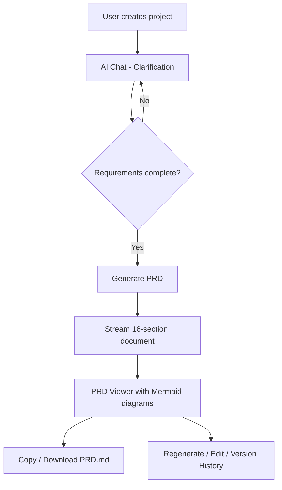

# ai-prd

AI-powered PRD (Product Requirements Document) generator that turns natural conversations into comprehensive, production-ready specification documents.

```
┌─────────────────────────────────────────────────────────────────┐
│                          ai-prd                                 │
│                                                                 │
│   ┌──────────┐    ┌──────────────┐     ┌───────────────────┐    │
│   │  Client  │───▶│  Next.js API │───▶│  LLM Provider     │    │
│   │  (React) │◀───│  (Streaming) │◀───│  (Anthropic/etc)  │    │
│   └──────────┘    └──────────────┘     └───────────────────┘    │
│        │                 │                                      │
│        │                 ▼                                      │
│        │          ┌──────────────┐                              │
│        │          │   SQLite DB  │                              │
│        │          │   (Prisma)   │                              │
│        │          └──────────────┘                              │
│        │                                                        │
│        ▼                                                        │
│   ┌──────────────────────────────────────────────────────┐      │
│   │                    PRD.md Output                     │      │
│   │  16 sections · Mermaid diagrams · Copy/Download      │      │
│   └──────────────────────────────────────────────────────┘      │
└─────────────────────────────────────────────────────────────────┘
```

## Features

- **Streaming AI Chat** — Real-time conversation with tool calls, powered by Vercel AI SDK
- **Interactive Clarification** — AI asks structured questions with clickable option cards
- **Web Search** — Built-in browsing capability for technical research during planning
- **Comprehensive PRD Generation** — 16-section document with architecture, API design, data model, roadmap
- **Live Mermaid Diagrams** — Flowcharts, ERDs, sequence diagrams rendered as SVG in the viewer
- **Version History** — Snapshots of every PRD revision, restore any version
- **Copy & Download** — One-click copy to clipboard or download as `PRD.md`
- **BYOK Multi-Provider** — Anthropic, OpenAI, Google, Ollama, LM Studio, AgentRouter
- **Docker Ready** — Single-command deployment with `docker compose up`

## Tech Stack

| Layer | Technology |
|-------|-----------|
| Framework | Next.js 16 (App Router, React 19) |
| AI | Vercel AI SDK v6 (`streamText`, `useChat`, tool calls) |
| UI | Tailwind CSS 4, shadcn/ui, Lucide icons |
| Database | SQLite via Prisma ORM |
| Diagrams | Mermaid.js (client-side SVG rendering) |
| Language | TypeScript 5 |
| Testing | Vitest, Playwright |

## Quick Start

### Prerequisites

- Node.js 20+
- npm

### Local Development

```bash
git clone https://github.com/mrizkihidayat66/ai-prd.git
cd ai-prd
npm install
cp .env.example .env
# Edit .env — add your ANTHROPIC_API_KEY (or other provider key)
npm run setup
npm run dev
```

Open http://localhost:3000

### Docker

```bash
# Set your API key
export ANTHROPIC_API_KEY="sk-ant-..."

# Build and run
docker compose up --build
```

The app will be available at http://localhost:3000. Data persists in a Docker volume.

## How It Works



1. **Create a project** from the dashboard
2. **Describe your idea** — the AI guides you through 8 requirement dimensions
3. **Answer clarification questions** — interactive cards with recommendations
4. **Generate PRD** — streams a comprehensive document in real-time
5. **Review & export** — rendered markdown with live diagrams, copy or download

## PRD Output Structure

The generated `PRD.md` contains 16 sections:

1. Executive Summary
2. Problem Statement & Goals
3. Target Users & Personas
4. User Stories & Acceptance Criteria
5. Feature Specification (MVP vs Future)
6. System Architecture (+ Mermaid flowchart)
7. Technology Stack
8. API Design (+ endpoint tables)
9. Data Model (+ Mermaid ERD)
10. UI/UX Flow (+ Mermaid diagram)
11. Implementation Roadmap
12. Effort Estimate
13. Non-Functional Requirements
14. Success Metrics & KPIs
15. Risks & Mitigations
16. Appendix: Sequence Diagrams

## Project Structure

```
src/
├── app/                          # Next.js pages and API routes
│   ├── api/
│   │   ├── chat/                 # Streaming chat with tool calls
│   │   ├── projects/[id]/
│   │   │   ├── generate/         # PRD generation (streaming)
│   │   │   ├── export/           # Download PRD.md
│   │   │   └── plan/             # Plan CRUD + snapshots
│   │   ├── models/               # Available model list per provider
│   │   └── settings/             # BYOK configuration
│   ├── new/                      # Chat page (new project)
│   ├── project/[id]/             # Project detail + PRD viewer
│   └── page.tsx                  # Dashboard
├── components/
│   ├── common/                   # Mermaid diagram renderer
│   ├── layout/                   # App shell with sidebar
│   └── ui/                       # shadcn/ui primitives
├── features/
│   ├── chat/                     # Chat UI + tool renderers
│   ├── dashboard/                # Project grid + cards
│   ├── plan/                     # PRD viewer + version selector
│   └── settings/                 # Settings dialog
├── lib/
│   ├── ai/
│   │   ├── prompts/              # System prompts (clarify, generate-prd)
│   │   └── provider.ts           # Multi-provider model factory
│   ├── db.ts                     # Prisma client singleton
│   └── utils.ts                  # Shared utilities
├── services/                     # Client-side API wrappers
├── constants/                    # App-wide constants
└── types/                        # TypeScript type definitions
prisma/
└── schema.prisma                 # Database schema
```

## Configuration

Use the in-app **Settings** dialog (sidebar gear icon) to configure:

- **Provider** — Anthropic (recommended), OpenAI, Google, Ollama, LM Studio, AgentRouter, OpenAI-compatible
- **Model** — Select from available models or add custom model IDs
- **API Key** — Your provider API key (stored locally in SQLite)
- **Base URL** — For self-hosted endpoints (Ollama, LM Studio)
- **Temperature** — Generation creativity (0.0 – 1.0)

## Development Commands

```bash
npm run dev          # Start dev server
npm run build        # Production build
npm run typecheck    # TypeScript check
npm run lint         # ESLint
npm run db:generate  # Regenerate Prisma client
npm run db:push      # Push schema to database
npm run db:reset     # Clean rebuild (dev only)
npm run db:studio    # Open Prisma Studio
npm run setup        # Full setup (env + doctor + generate)
```

## License

MIT
